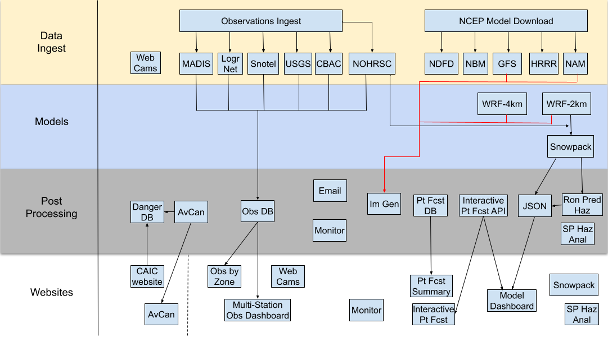

# System Architecture

This document describes the CAIC operational system.

## High-Level Operational Components

1. **System Management** Scripts to manage operations. [bin]
2. **NCEP Model Ingest** Scripts to ingest NCEP model data. [download]
3. **Observations** Software to manage weather observations ingest and database insertion. [obs]
4. **Post-Processing** A suite of software to handle a variety of post-processing tasks. [post]
5. **Snowpack** Software to run SLF Snowpack model. [snowpack]

## Database Overview

* **Raw Observations** 
* **Point Forecasts** 
* **Snowpack** 

## Workflow Overview

